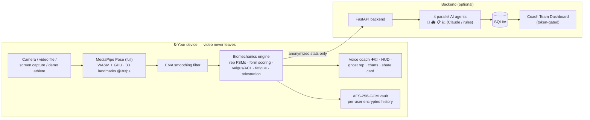

# 🏋️ FormCoach AI


**Every athlete deserves a coach. Now everyone has one.**

FormCoach AI is a real-time sports form coach that runs **entirely in your browser**.
Point your webcam at yourself, pick a drill, and it counts your reps, scores every
rep's form 0–100, and **speaks coaching cues out loud** — "go deeper", "chest up",
"hips sagging" — exactly like a coach standing next to you.

Built solo in under 48 hours for **United Hacks V7** (Sports track).

**▶ Demo video:** _coming — link will be added at submission_ · **Live demo:** https://auth889-ai.github.io/united/

## ✨ Features

- **🏁 Guided workout mode** — pick sets × reps and the coach runs the whole workout
  by voice: counts you through each set, calls rest periods with a countdown, announces
  the next set
- **🧑‍🏫 Coach Team Dashboard** — one backend serves a whole squad: every athlete's
  sessions, form trends, and injury-risk flags in one view (`http://localhost:8001/dashboard?key=coach-demo` — token-gated; set `COACH_KEY` env to change it)
- **👤 Zero-knowledge accounts** — email + password sign-in where the password never
  leaves the device and each user's history is **AES-256-GCM encrypted at rest** with a
  key derived from her password (PBKDF2, 150k iterations). On a shared machine, another
  user — or anyone reading localStorage — sees only ciphertext. No server, no account
  database, nothing to breach
- **🔒 Live privacy proof** — an on-screen counter of frames analyzed on-device vs
  video bytes uploaded (always 0), plus a local-only mode that sends nothing at all
- **📐 Live telestration** — broadcast-style joint-angle readouts (knee/elbow degrees)
  drawn on the athlete in real time
- **👻 Ghost rep** — your best-scoring rep replays as a translucent skeleton over you,
  so every rep races your own best form
- **📼 Analyze ANY video** — upload a recording, or **capture your screen** and point it
  at a playing YouTube video: the engine overlays the skeleton and coaches the athlete
  in the video live
- **▶ Demo mode — no camera needed**: a synthetic athlete performs squats (including
  deliberately bad reps) through the same biomechanics engine, so judges and visitors
  see the AI coaching live in 5 seconds
- **4 drills**: Squat · Push-up · Bicep curl · **Vertical jump test** (measures your
  jump height in centimetres with no equipment — just your height for calibration)
- **Real-time pose tracking** — 33 body landmarks at ~30fps (MediaPipe **full** model),
  EMA-smoothed for stable angles and a steady skeleton overlay
- **Biomechanics engine** — joint-angle state machines detect reps and phases; each rep
  is scored against the same faults a physio checks (depth, body line, elbow drift, torso lean)
- **Voice coaching** — the highest-priority fault is spoken via the Web Speech API, so you
  never look at the screen mid-set
- **Hands-free voice control AND conversation** — say "squats", "start", "finish" and the
  app obeys; ask it anything else ("what should I fix first?", "give me a plan") and the
  coach **answers out loud**. A full voice-in/voice-out coaching conversation, making it
  the first workout coach that **blind and low-vision athletes can use entirely eyes-free**
  (Chrome/Edge)
- **Progress tracking** — per-session form scores charted over time (with an accessible table view)
- **AI coach chat** — a built-in rules coach that knows your session stats; optionally plug
  in **Ollama** (`http://localhost:11434/v1/chat/completions`, model `llama3.2`, no key —
  a fully local, private LLM) or any OpenAI-compatible API (e.g. Featherless AI)
- **Installable PWA** — add it to your home screen like a native app; the shell
  works offline via a service worker
- **Privacy by architecture** — inference is on-device (WebAssembly + GPU).
  **Zero bytes of video ever leave your machine.**

- **Multi-agent AI coaching backend** — when you finish a session, your joint-angle
  stats (never video) go to a FastAPI backend where **4 specialized AI agents analyze
  in parallel**: 🦵 Biomechanics · 🚑 Injury Risk · 📋 Programming · 📈 Progress.
  Every agent returns a score, findings, and its **reasoning** — transparent AI, not a
  black box. Claude-powered when `ANTHROPIC_API_KEY` is set, with a deterministic
  rules engine fallback so it always works. Reports persist in SQLite.

## 🏗 Architecture



## 🚀 Run it

**Frontend** (no build step — any static server):

```bash
python3 -m http.server 8000 --directory frontend
# open http://localhost:8000
```

(A server is required — camera access and ES modules don't work from `file://`.)

**Backend** (multi-agent coaching report):

```bash
cd backend
pip install -r requirements.txt
export ANTHROPIC_API_KEY=sk-...   # optional — falls back to rules engine without it
uvicorn app.main:app --port 8001
```

Works in Chrome/Edge (best), Firefox and Safari. Allow camera access, stand back so
your whole body is in frame, and press **Start session**.

## 🧠 How it works

1. **Pose estimation** — [MediaPipe Pose Landmarker](https://developers.google.com/mediapipe)
   (lite model, GPU delegate) tracks 33 landmarks per frame, fully on-device.
2. **Biomechanics** — for each exercise, a state machine over joint angles
   (hip–knee–ankle for squats, shoulder–elbow–wrist for push-ups/curls,
   shoulder–hip–ankle for body line) detects rep phases and completions.
3. **Form scoring** — each rep starts at 100 and loses points per fault
   (insufficient depth, torso lean > 50°, body-line collapse < 155°, elbow drift > 35°…).
4. **Jump height** — hip landmarks are calibrated against your standing posture; hip
   rise at the jump apex is converted from normalized units to centimetres using your
   real height as the scale reference.
5. **Coaching** — faults are prioritized (critical > warning > info) and spoken with a
   cooldown so the coach talks like a human, not an alarm.

## 🛠 Stack

**Frontend:** Vanilla JavaScript (ES modules) · MediaPipe Tasks Vision · Web Speech
API (synthesis + recognition) · Canvas + SVG · localStorage — no framework, no build.
**Backend:** Python · FastAPI · Anthropic Claude (parallel `asyncio` agents,
Pydantic-validated structured outputs) · SQLite.

## 📁 Structure

```
frontend/                       static web app (auto-deployed to GitHub Pages by CI)
  index.html                    app shell + landing
  manifest.json · sw.js         installable PWA + offline service worker
  assets/icon.svg               app icon
  src/
    app.js                      entry point — camera, inference loop, session lifecycle
    engine/
      exercises.js              biomechanics core: joint-angle math + rep state machines
    services/
      coach.js                  voice cues, session summaries, chat coach (+ optional LLM)
      voice.js                  hands-free voice control (speech recognition grammar)
    ui/
      report.js                 multi-agent AI coaching report (radar chart)
      chart.js                  progress chart (tooltips, table view, direct labels)
      share.js                  downloadable session share card (canvas PNG)
    styles/main.css             dark athletic design system
backend/                        multi-agent coaching API (layered FastAPI package)
  app/
    main.py                     app factory + middleware
    routes.py                   API endpoints
    dashboard.py                coach team dashboard (multi-athlete view)
    agents.py                   the 4 coaching agents (Claude + rules engines)
    models.py                   Pydantic schemas
    db.py                       SQLite persistence
  tests/test_api.py             API test suite (pytest)
  requirements.txt
.github/workflows/
  ci.yml                        runs backend + engine test suites on every push
  deploy.yml                    deploys frontend/ to GitHub Pages on every push
```

## ✅ Tests

```bash
pytest backend/tests -v              # 8 API tests
node frontend/tests/engine.test.mjs  # 7 biomechanics engine tests
node frontend/tests/auth.test.mjs    # 12 zero-knowledge auth tests
node frontend/tests/smooth.test.mjs  # 4 landmark-filter tests
```

Both suites run automatically in CI on every push.

## ⚖️ License & credits

MIT. Pose estimation by Google MediaPipe. Everything else written from scratch
during the United Hacks V7 hacking window.
